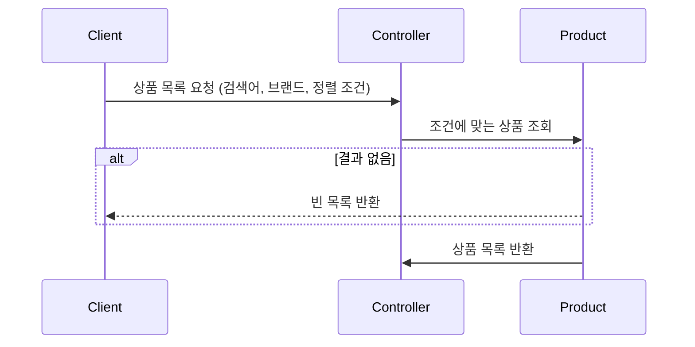
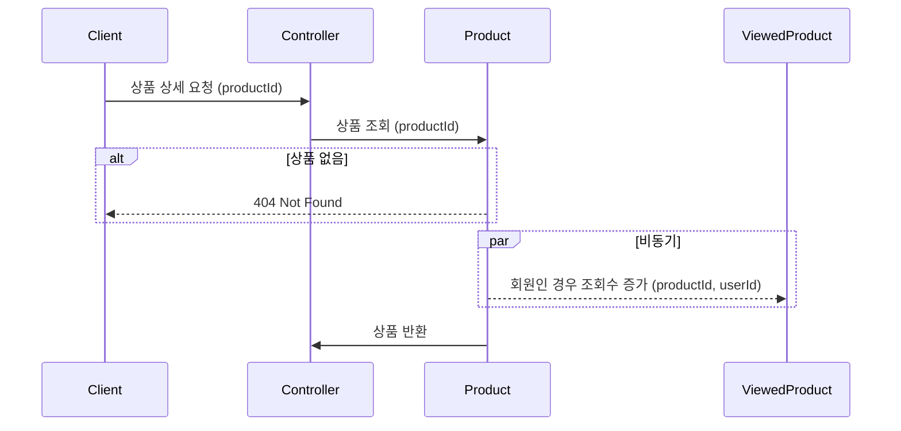
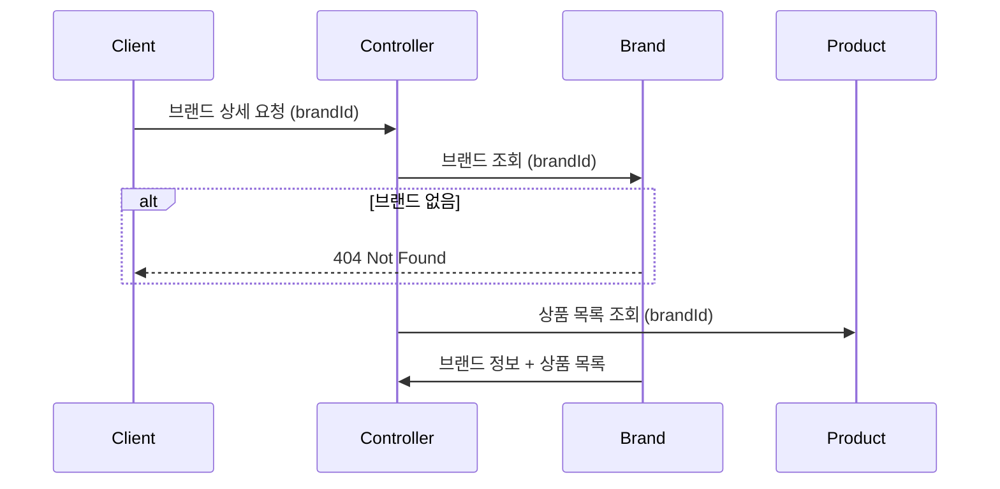
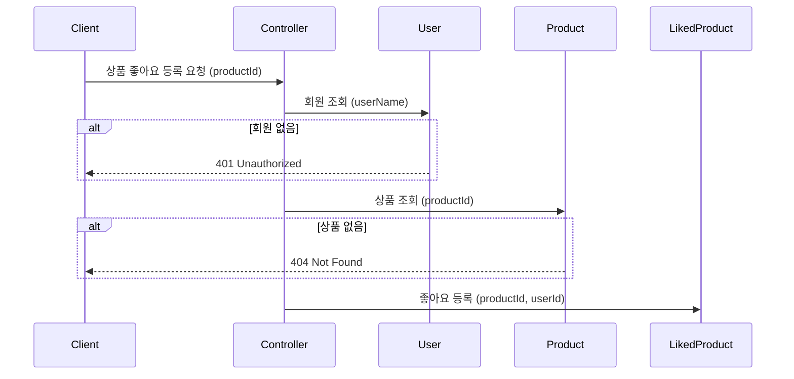
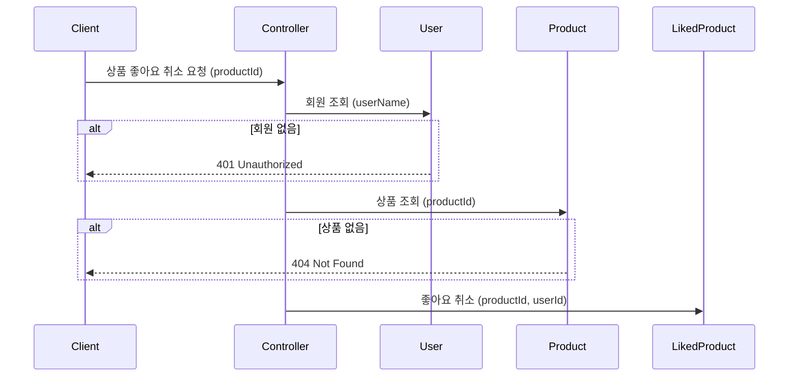
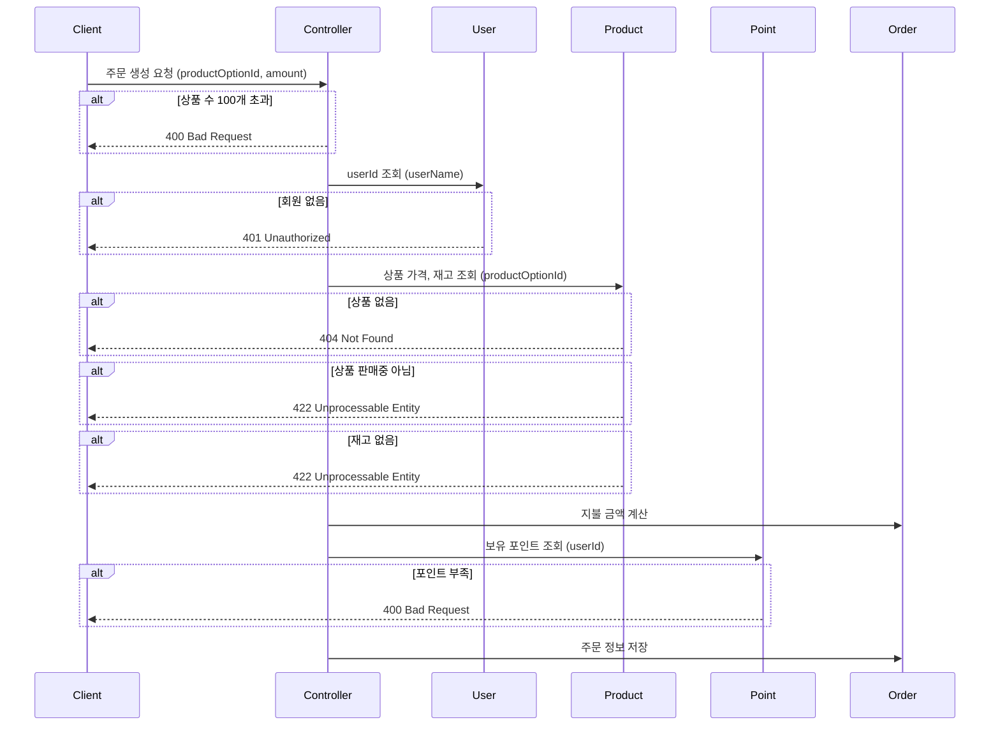
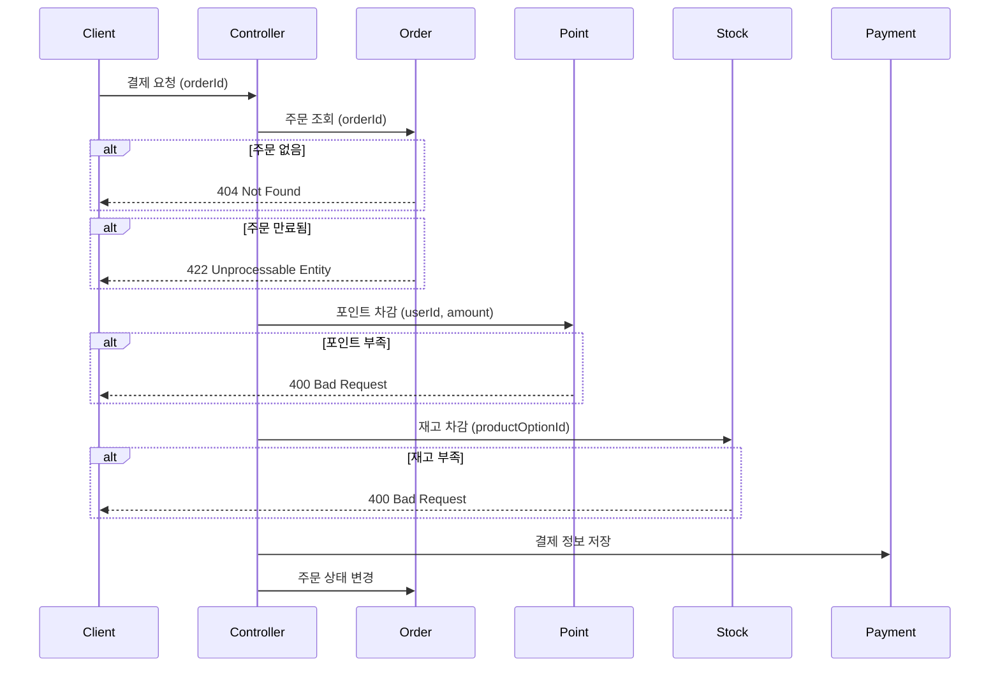

# 시퀀스 다이어그램

## 상품 목록 조회

```mermaid
sequenceDiagram
    participant Client
    participant C as Controller
    participant P as Product
    Client ->> C: 상품 목록 요청 (검색어, 브랜드, 정렬 조건)
    C ->> P: 조건에 맞는 상품 조회
    alt 결과 없음
        P -->> Client: 빈 목록 반환
    end
    P ->> C: 상품 목록 반환
```

## 상품 상세 조회

```mermaid
sequenceDiagram
    participant Client
    participant C as Controller
    participant P as Product
    participant VP as ViewedProduct
    Client ->> C: 상품 상세 요청 (productId)
    C ->> P: 상품 조회 (productId)
    alt 상품 없음
        P -->> Client: 404 Not Found
    end
    par 비동기
        P -->> VP: 회원인 경우 조회수 증가 (productId, userId)
    end
    P ->> C: 상품 반환
```

## 브랜드 상세 조회

```mermaid
sequenceDiagram
    participant Client
    participant C as Controller
    participant B as Brand
    participant P as Product
    Client ->> C: 브랜드 상세 요청 (brandId)
    C ->> B: 브랜드 조회 (brandId)
    alt 브랜드 없음
        B -->> Client: 404 Not Found
    end
    C ->> P: 상품 목록 조회 (brandId)
    B ->> C: 브랜드 정보 + 상품 목록
```

## 상품 좋아요 등록

```mermaid
sequenceDiagram
    participant Client
    participant C as Controller
    participant U as User
    participant P as Product
    participant LP as LikedProduct
    Client ->> C: 상품 좋아요 등록 요청 (productId)
    C ->> U: 회원 조회 (userName)
    alt 회원 없음
        U -->> Client: 401 Unauthorized
    end
    C ->> P: 상품 조회 (productId)
    alt 상품 없음
        P -->> Client: 404 Not Found
    end
    C ->> LP: 좋아요 등록 (productId, userId)
```

## 상품 좋아요 취소

```mermaid
sequenceDiagram
    participant Client
    participant C as Controller
    participant U as User
    participant P as Product
    participant LP as LikedProduct
    Client ->> C: 상품 좋아요 취소 요청 (productId)
    C ->> U: 회원 조회 (userName)
    alt 회원 없음
        U -->> Client: 401 Unauthorized
    end
    C ->> P: 상품 조회 (productId)
    alt 상품 없음
        P -->> Client: 404 Not Found
    end
    C ->> LP: 좋아요 취소 (productId, userId)
```

## 주문 생성

```mermaid
sequenceDiagram
    participant Client
    participant C as Controller
    participant U as User
    participant PRD as Product
    participant PNT as Point
    participant O as Order
    Client ->> C: 주문 생성 요청 (productOptionId, amount)
    alt 상품 수 100개 초과
        C -->> Client: 400 Bad Request
    end
    C ->> U: userId 조회 (userName)
    alt 회원 없음
        U -->> Client: 401 Unauthorized
    end
    C ->> PRD: 상품 가격, 재고 조회 (productOptionId)
    alt 상품 없음
        PRD -->> Client: 404 Not Found
    end
    alt 상품 판매중 아님
        PRD -->> Client: 422 Unprocessable Entity
    end
    alt 재고 없음
        PRD -->> Client: 422 Unprocessable Entity
    end
    C ->> O: 지불 금액 계산
    C ->> PNT: 보유 포인트 조회 (userId)
    alt 포인트 부족
        PNT -->> Client: 400 Bad Request
    end
    C ->> O: 주문 정보 저장
```

## 결제 요청

```mermaid
sequenceDiagram
    participant Client
    participant C as Controller
    participant O as Order
    participant PNT as Point
    participant S as Stock
    participant PAY as Payment
    Client ->> C: 결제 요청 (orderId)
    C ->> O: 주문 조회 (orderId)
    alt 주문 없음
        O -->> Client: 404 Not Found
    end
    alt 주문 만료됨
        O -->> Client: 422 Unprocessable Entity
    end
    C ->> PNT: 포인트 차감 (userId, amount)
    alt 포인트 부족
        PNT -->> Client: 400 Bad Request
    end
    C ->> S: 재고 차감 (productOptionId)
    alt 재고 부족
        S -->> Client: 400 Bad Request
    end
    C ->> PAY: 결제 정보 저장
    C ->> O: 주문 상태 변경
```
