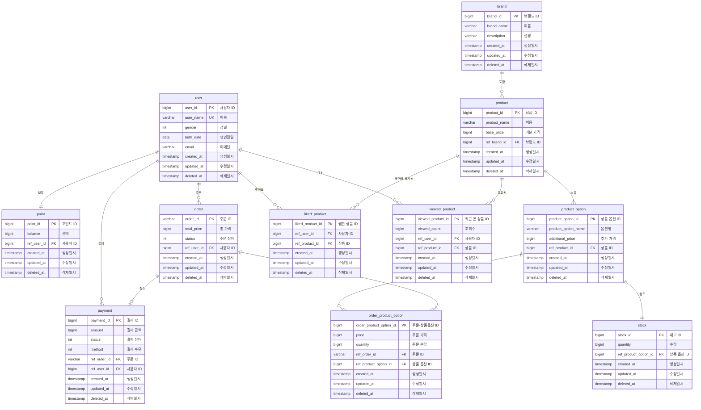

# ERD

```mermaid
erDiagram
    user {
        bigint user_id PK "사용자 ID"
        varchar user_name UK "이름"
        int gender "성별"
        date birth_date "생년월일"
        varchar email "이메일"
        timestamp created_at "생성일시"
        timestamp updated_at "수정일시"
        timestamp deleted_at "삭제일시"
    }

    point {
        bigint point_id PK "포인트 ID"
        bigint balance "잔액"
        bigint ref_user_id FK "사용자 ID"
        timestamp created_at "생성일시"
        timestamp updated_at "수정일시"
        timestamp deleted_at "삭제일시"
    }

    brand {
        bigint brand_id PK "브랜드 ID"
        varchar brand_name "이름"
        varchar description "설명"
        timestamp created_at "생성일시"
        timestamp updated_at "수정일시"
        timestamp deleted_at "삭제일시"
    }

    product {
        bigint product_id PK "상품 ID"
        varchar product_name "이름"
        bigint base_price "기본 가격"
        bigint ref_brand_id FK "브랜드 ID"
        timestamp created_at "생성일시"
        timestamp updated_at "수정일시"
        timestamp deleted_at "삭제일시"
    }

    product_option {
        bigint product_option_id PK "상품 옵션 ID"
        varchar product_option_name "옵션명"
        bigint additional_price "추가 가격"
        bigint ref_product_id FK "상품 ID"
        timestamp created_at "생성일시"
        timestamp updated_at "수정일시"
        timestamp deleted_at "삭제일시"
    }

    stock {
        bigint stock_id PK "재고 ID"
        bigint quantity "수량"
        bigint ref_product_option_id FK "상품 옵션 ID"
        timestamp created_at "생성일시"
        timestamp updated_at "수정일시"
        timestamp deleted_at "삭제일시"
    }

    order {
        varchar order_id PK "주문 ID"
        bigint total_price "총 가격"
        int status "주문 상태"
        bigint ref_user_id FK "사용자 ID"
        timestamp created_at "생성일시"
        timestamp updated_at "수정일시"
        timestamp deleted_at "삭제일시"
    }

    order_product_option {
        bigint order_product_option_id PK "주문-상품옵션 ID"
        bigint price "주문 가격"
        bigint quantity "주문 수량"
        varchar ref_order_id FK "주문 ID"
        bigint ref_product_option_id FK "상품 옵션 ID"
        timestamp created_at "생성일시"
        timestamp updated_at "수정일시"
        timestamp deleted_at "삭제일시"
    }

    payment {
        bigint payment_id PK "결제 ID"
        bigint amount "결제 금액"
        int status "결제 상태"
        int method "결제 수단"
        varchar ref_order_id FK "주문 ID"
        bigint ref_user_id FK "사용자 ID"
        timestamp created_at "생성일시"
        timestamp updated_at "수정일시"
        timestamp deleted_at "삭제일시"
    }

    liked_product {
        bigint liked_product_id PK "찜한 상품 ID"
        bigint ref_user_id FK "사용자 ID"
        bigint ref_product_id FK "상품 ID"
        timestamp created_at "생성일시"
        timestamp updated_at "수정일시"
        timestamp deleted_at "삭제일시"
    }

    viewed_product {
        bigint viewed_product_id PK "최근 본 상품 ID"
        bigint viewed_count "조회수"
        bigint ref_user_id FK "사용자 ID"
        bigint ref_product_id FK "상품 ID"
        timestamp created_at "생성일시"
        timestamp updated_at "수정일시"
        timestamp deleted_at "삭제일시"
    }

    user ||--|| point: "보유"
    user ||--o{ order: "주문"
    user ||--o{ payment: "결제"
    user ||--o{ liked_product: "좋아요"
    user ||--o{ viewed_product: "조회"
    brand ||--o{ product: "포함"
    product ||--|{ product_option: "소유"
    product ||--o{ liked_product: "좋아요 표시됨"
    product ||--o{ viewed_product: "조회됨"
    product_option ||--|| stock: "참조"
    product_option ||--o{ order_product_option: "참조"
    order ||--o| payment: "참조"
    order ||--|{ order_product_option: "소유"
```
